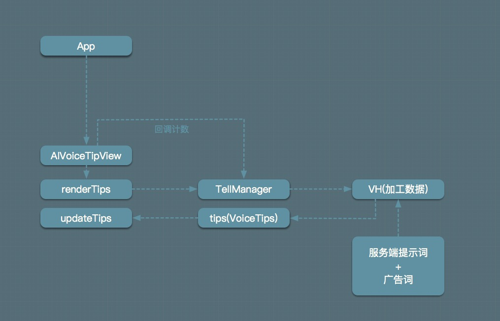

# 瀑布流中VoiceTip的使用


使用流程：



``` java
// 第一步，获取VoiceTipView
AIVoiceTipView tipsView = findViewById(XXX);
// 第二步，设置本地词
VoiceTips tips = new VoiceTips();
tips.pck = "ok.less.org.okl"
tips.className = "com.bftv.fui.launcher.views.activity.IndexRootActivity"
tips.classNameAppend = "cartoonTabTag"
tips.version = "4.0" // 集成app的version
tips.refreshTime = "20000" // 默认10秒 具体看产品定义

tips.add("美国大片")
tips.add("听学猫叫")
tips.add("可乐鸡翅怎么做")

// 注册tips渲染回调(将实际显示的词回调回来) 不需要刻意忽略
tipsView.setTipsListener(listener);
// 此时会显示数据，并将数据发送给大耳朵处理，处理完成后通过IUserStatusNotice的tips方法返回处理结果
tipsView.renderTips(Application, tips);
// 第三步，将tips方法回调的处理结果更新到VoiceTipView，注意是IUserStatusNotice的tips方法返回的处理结果
// 注意，是在AIDL的tips回调方法中调用如下方法
TellManagerHelper.getInstance().notifyTipsChange(tips); // 此行代码的作用是替代之前的调用updateTips方法，也就是说 不用再调用updateTips方法

// ###### 以下方法需要手动调用 ###### //

// 当VoiceTips界面不可见时需要暂停动画 节省资源
tipsView.pauseAnim();
// 重新可见时恢复动画
tipsView.resumeAnim();
// 界面销毁时释放
tipsView.release();

// ###### ################ ###### //

```

需要引入的资源：<br>
``` java
// 大耳朵头像显示需要
lib.sharedres-release.aar
//VoiceTipView库
voice-lib.voicetip-XXX.aar
authentication-XXX.jar
constantplugin-XXX.jar
thirdtell-XXX.jar
voicethirdparty-XXX.jar
```
